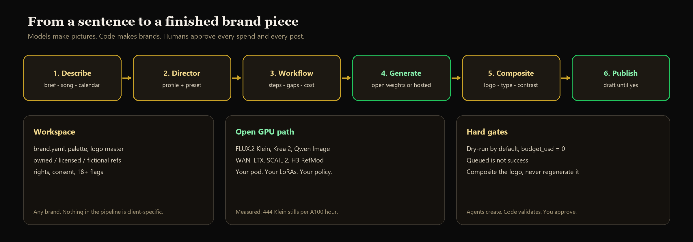
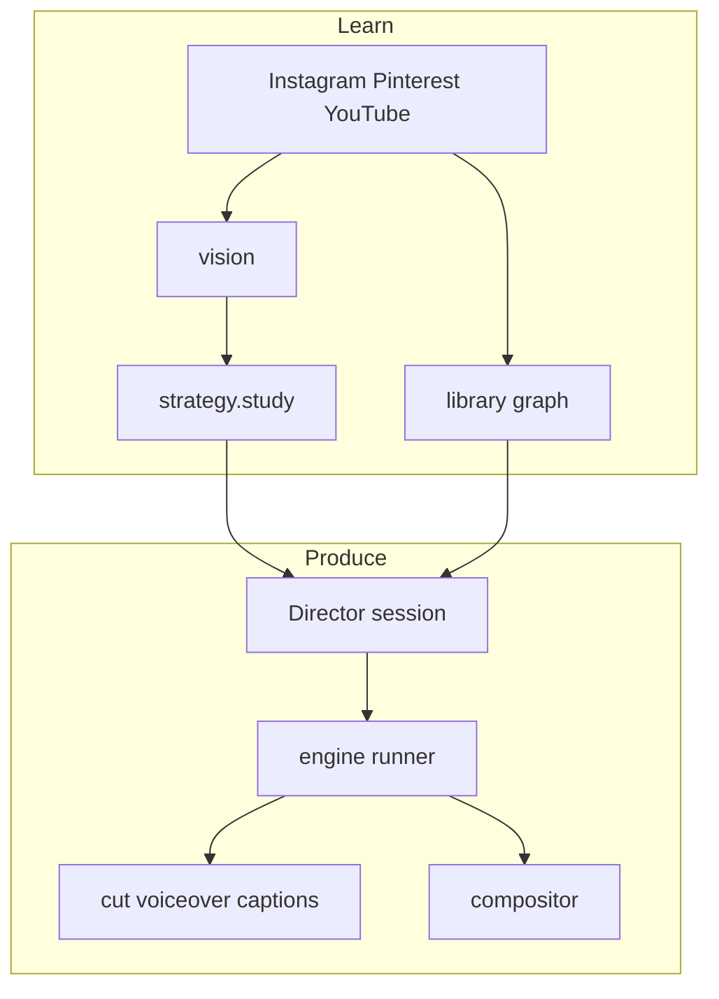
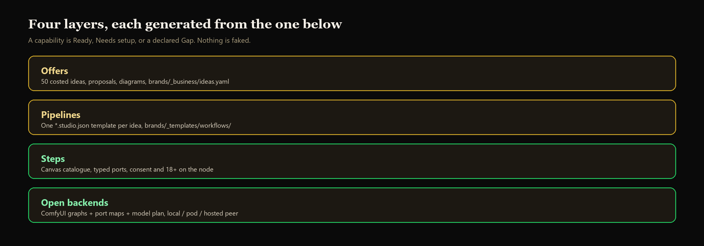
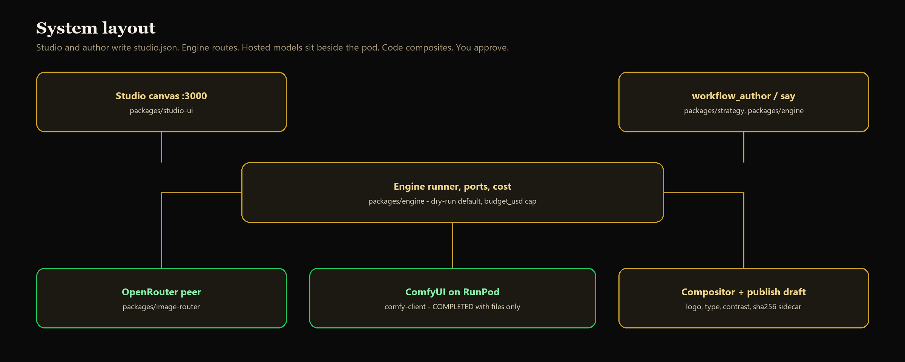
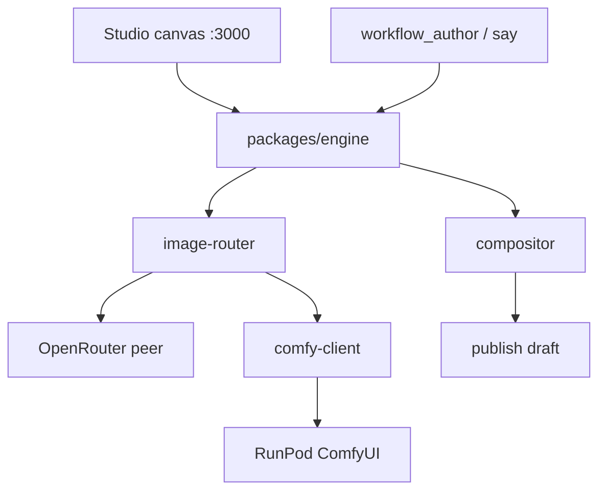
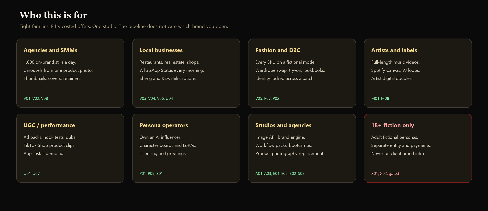
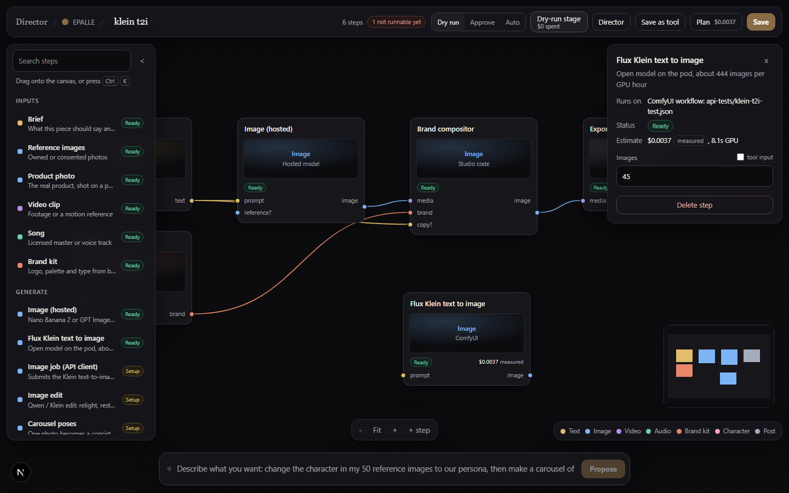
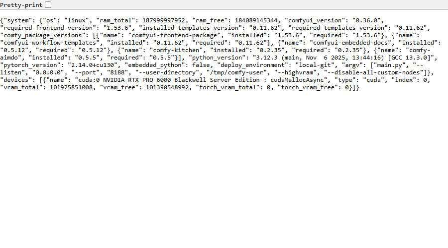
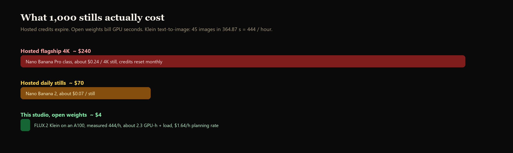

# Director


Workflow engine, Studio canvas, ComfyUI on RunPod. Hosted models (OpenRouter) sit beside the pod as a peer, not above it. The model is allowed to surprise you on light and motion; logo, type, palette, and disclosure are applied in code and never left to a sampler.

The git folder is still `ngoma`. That is the path. The product is Director.


## Behaviour

A workspace is `brands/<key>/` with a `brand.yaml`. Two already live here so the pipeline cannot cheat: `epalle` (music) and `ongea-pesa` (fintech). They share no palette, ethics, or output.

You describe a job. The engine or the author writes a `*.studio.json` the canvas opens. Each step names its backend: a Comfy graph in `workflows/` with a `.ports.json` map, a router profile, a studio module, a publisher, or `gap`. Gaps are shown. They are not dressed up as tiles.

Dry-run is the default. `budget_usd` in `brands/_presets/engine.yaml` is a hard cap the engine never raises. Live Comfy or hosted work needs an explicit run mode and a human approval. `IN_QUEUE` is not success — only a completed history with output files counts.



```mermaid
flowchart LR
  brief["Brief"] --> workspace["Workspace"]
  workspace --> director["Director"]
  director --> graph["studio.json"]
  graph --> gate{"Human gate"}
  gate -->|"dry-run default"| nospend["No spend"]
  gate -->|"approved budget"| router["image-router"]
  router --> hosted["OpenRouter"]
  router --> comfy["ComfyUI"]
  hosted --> base["Base visual"]
  comfy --> base
  base --> compositor["Compositor"]
  compositor --> draft["Publish draft"]
  draft --> you["You approve"]
```



## Layout







| Path | Role |
|---|---|
| `packages/engine` | sessions, describe, runner, port maps, cost |
| `packages/studio-ui` | Next.js node canvas (`localhost:3000`) |
| `packages/comfy-client` | validate / run; COMPLETED with files only |
| `packages/image-router` | OpenRouter and Comfy as peers, contract prices |
| `packages/compositor` | logo, type, contrast, sha256 sidecar |
| `packages/strategy` | workspaces, author, proposals, diagrams |
| `brands/<key>/` | `brand.yaml`, `references/`, `workflows/`, `runs/` (gitignored) |
| `workflows/` | Comfy graphs, `manifest.json`, port maps |
| `infra/runpod/` | official Comfy image, volume bind, downloads |

Fifty costed offers, each with a proposal, a diagram, and a `*.studio.json` template: [`docs/business/IDEAS-50.md`](docs/business/IDEAS-50.md) · [`docs/diagrams/ideas/`](docs/diagrams/ideas/README.md).



## Canvas and pod

Proof from the live Studio canvas and the bound ComfyUI worker (`work/ui-proof`, committed with the RunPod one-click bind):





## Local

Python 3.12 with `pyyaml`, `pillow`, `pytest`. `uv` is optional. On Windows, set `$env:PYTHONIOENCODING = 'utf-8'` or the console mangles output.

```powershell
python studio.py check
python studio.py doctor
python -m pytest -q
python packages/strategy/workspace.py list
python packages/engine/cli.py ports-check
python packages/strategy/workflow_author.py --check
```

`studio.py check` fails if anything secret-shaped is tracked. Secrets live in Windows DPAPI (`python infra/runpod/set_secret.py --list`); adapters read them through `packages/common/vault.py`. No live `.env` is committed.

```powershell
npm install --prefix packages/studio-ui
npm run dev --prefix packages/studio-ui
```

No GPU required for planning, validation, or compositing:

```powershell
python packages/compositor/compositor.py --base out/_synthetic_base.png --idea 1 --ratio 4:5 --slide 1/5
```

## GPU


Official image: `runpod/comfyui:cuda12.8`. Models, custom nodes, and workflows live on network volume `t023496m3n` (600 GB, US-NC-2). Current pod, from `infra/runpod/active-pod.json`:

| | |
|---|---|
| id | `u0rccyaj40w5no` (`director-comfyui`) |
| GPU | NVIDIA RTX PRO 6000 Blackwell Server Edition, $1.69/h |
| Comfy | `https://u0rccyaj40w5no-8188.proxy.runpod.net` |

Do not attach volume `7y7jyghmua` or call serverless endpoint `ugtmfoidpnh8pd`. Those IDs belong to another account.

`python infra/runpod/one_click.py` is the bind: it writes `extra_model_paths.yaml` so every model folder on the volume (including `upscale_models`) is visible to loaders, then restarts Comfy. The Comfy UI Refresh button does not pick up a newly added folder.

```powershell
python infra/runpod/one_click.py
python infra/runpod/one_click.py --create --full
python infra/runpod/provision_pod.py --status
python infra/runpod/provision_pod.py --stop u0rccyaj40w5no
```

`--create` provisions if nothing is running. `--full` installs node packs and resumes priority downloads. SSH key search order is `~/.ssh/director_runpod`, then `infra/epalle_runpod_ed25519`. A stopped pod does not bill GPU hours; the volume still does.

RunPod serverless has never returned `COMPLETED` with files. Pod-side has: 45 FLUX.2 Klein stills in 364.87 s on an earlier A100 (444 stills/GPU-hour).



## Engine

```powershell
python packages/strategy/workflow_author.py --brief "Sheng WhatsApp status ad for a mama mboga" --client ongea-pesa
python packages/engine/cli.py say --client epalle --session s1 --text "a lookbook of one persona across a city evening, neon noir"
python packages/engine/cli.py describe --client epalle --text "a lookbook of one persona across a city evening, neon noir"
python packages/engine/cli.py run --client epalle --workflow <id> --stage next
```

`--brief` matches words to steps and wires them by port type. `say` grows a saved session; replay it and the graph is the same. `describe` is the same contract the canvas bar uses. `run --stage next` is dry-run unless you pass a live / stage-approval mode and `--approve-as`.

A reference folder is a batch. Spell a step `<step>@each` and it runs once per item, with the count known before the gate.


## Rules

These failed expensively when they were only conventions.

1. Queued is not success.
2. A check that could not run reports `UNVERIFIED`, never `OK`.
3. Dry-run by default. Spending or publishing needs an explicit flag.
4. Composite the logo. Never regenerate it.
5. No person's name or likeness in a prompt. A real face is data only with a written release in `collection.json`.
6. 18+ steps do not run on a client workspace's infrastructure.

## Not yet

- RunPod serverless: never completed a generation. Do not schedule work on it.
- Instagram publish: Professional account linked to a Facebook Page.
- Video `relight`: catalogue `backend.kind: gap`.
- Sheng voiceover: refused. No TTS speaks it; providers fake Swahili.

Register: [`docs/BLOCKERS.md`](docs/BLOCKERS.md).

## Docs

- [`docs/SETUP.md`](docs/SETUP.md) — machine setup; steps that need a login are marked **[you]**
- [`docs/engine/DIRECTOR-ENGINE.md`](docs/engine/DIRECTOR-ENGINE.md) — engine
- [`infra/runpod/README.md`](infra/runpod/README.md) — pod bind, downloads, paid proof sequence
- [`docs/workflows/WORKFLOWS.md`](docs/workflows/WORKFLOWS.md) — graphs the pod can run
- [`brands/_kit/README.md`](brands/_kit/README.md) — new workspace
- [`docs/business/IDEAS-50.md`](docs/business/IDEAS-50.md) — 50 costed offer templates
- [`docs/diagrams/ideas/`](docs/diagrams/ideas/README.md) — one workflow diagram per offer
- [`docs/LICENSING.md`](docs/LICENSING.md) — three licences in play
