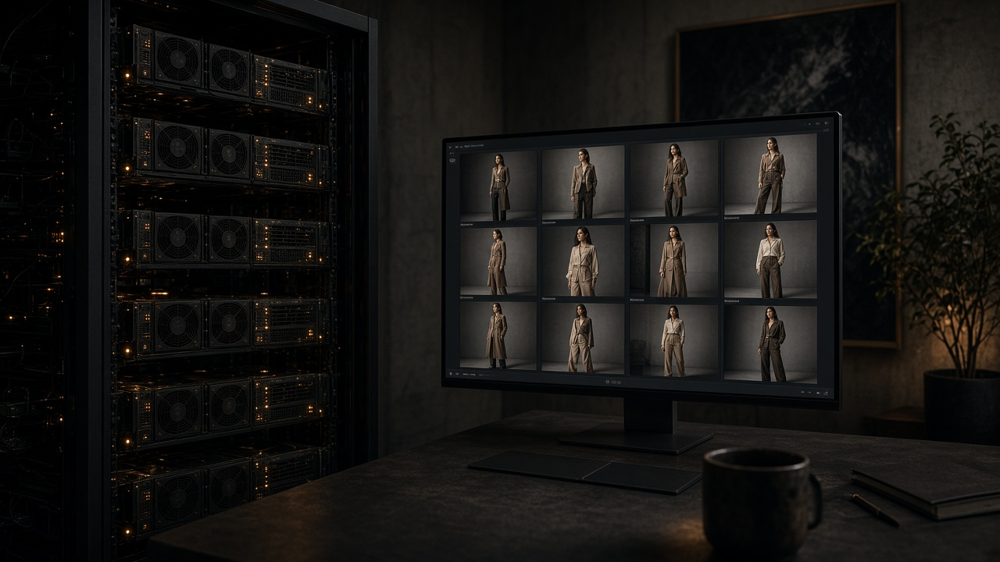
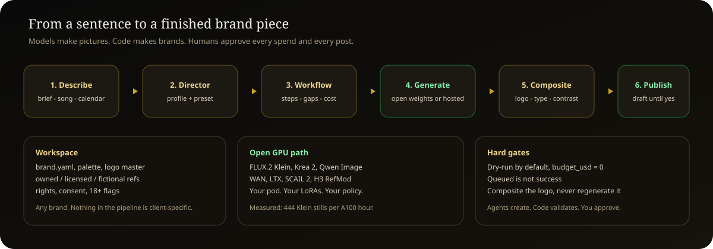
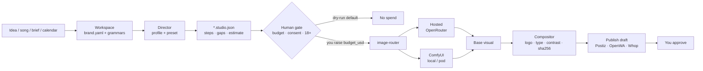
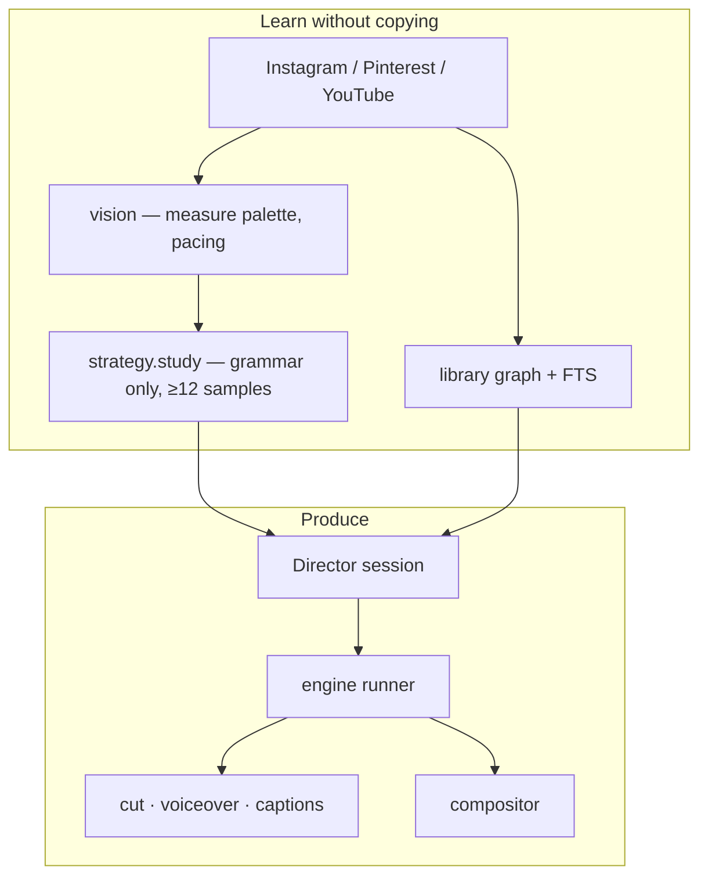

<p align="center">
  
</p>

<p align="center">
  <strong>A sentence in. A costed, on-brand production pipeline out.</strong><br/>
  Open weights on your GPU. Hosted models when you want them. Nothing spends or publishes until you say yes.
</p>
    
<p align="center">
  
  
  
  
  
  
  
  
</p>

<p align="center">
  <a href="#the-problem">Problem</a> ·
  <a href="#who-this-is-for">Who it helps</a> ·
  <a href="#open-weights-not-a-credit-meter">Open weights</a> ·
  <a href="#how-a-brief-becomes-a-brand">How it works</a> ·
  <a href="#start-here">Start here</a> ·
  <a href="#read-next">Docs</a>
</p>

<p align="center">
  
</p>

The git folder is still called `ngoma`. That word is a drum. It never covered music videos, WhatsApp Status for a mama mboga, an AI influencer LoRA, a 50-image character swap into carousels, or a fintech claim check. The product is **Director**: a general creative studio for any brand, any capability, running open models first.

> **Models make pictures. Code makes brands.**

---

## The problem

Generating an image got cheap. Running a **brand** did not.

Point Midjourney, Higgsfield, or a hosted image API at “make a post for my app” thirty times and you get thirty different companies. The green drifts. The logo comes back misspelled. One frame is a photograph, the next is an illustration. Each file is fine. Together they are noise.

The usual answer is to prompt harder. That helps and it does not solve it, because you are asking a probabilistic system to be deterministic about the exact things that must never vary: the mark, the type, the palette, the disclosure.

The other answer is to rent a credit meter.

| What you buy today | What you actually get |
|---|---|
| Higgsfield Plus ~$59 / month | 1,200 credits that **reset**. About 53 Seedance clips if you never re-roll. ~$1 per keep. |
| Hosted flagship 4K still | On the order of **$0.24** per image (Nano Banana Pro class). 1,000 stills ≈ **$240**. |
| Hosted daily still | On the order of **$0.07** per image. 1,000 stills ≈ **$70**. |
| Midjourney / Runway / Kling | Fast hours and credits that expire. Their filter is the product. |

And the filter is not a side effect. Hosted models refuse fashion anatomy, adult fictional personas, local-language ads that sound like a real street, and a lot of ordinary commercial work. You are renting someone else’s taste, someone else’s ToS, and someone else’s invoice.

<p align="center">
  
</p>

**This studio’s measured number:** FLUX.2 Klein text-to-image on the pod made 45 images in 364.87 seconds. That is **444 stills per GPU-hour**. A thousand images is about 2.3 GPU-hours plus load — on the order of **$4** at the A100 planning rate of $1.64/h. Credits do not expire. The weights stay on the machine.

Hosted models are still there as a **peer**, not a boss. Use Nano Banana 2 through OpenRouter when you want a flagship still and no GPU. Route carousels, identity, video, and batches to ComfyUI because hosted endpoints cannot lock a face across fifty files.

<p align="center">
  
</p>

---

## Who this is for

Director is for people who already know what they would ship if generation were cheap, consistent, and allowed.

<p align="center">
  
</p>

| You | What you stop paying for | What you open |
|---|---|---|
| **Social media agency** running 10+ accounts | A designer’s day and a Midjourney seat per client | V01 — 1,000 on-brand stills by 9am |
| **Boutique / D2C** | A monthly shoot for every SKU | V02 — 30 carousels from one product photo |
| **Restaurant, agent, mama mboga** | A Nairobi agency retainer | V04 / V06 — food visuals, WhatsApp Status, Sheng captions |
| **Fashion brand** | Model days and retouching | V05 / P07 — fictional or licensed models, wardrobe swap |
| **Artist or label** | A video treatment that dies in a deck | M01–M08 — lookbook, Canvas, digital double, VJ loops |
| **Performance / UGC buyer** | Creator coordination for every hook | U01–U07 — ad packs, TikTok Shop, hook tests, dubs |
| **Persona operator** | A new face every week | P01–P09 — dataset, RefMod, LoRA, greetings |
| **Studio or educator** | Closed SaaS you cannot inspect | A01–A03, E01–E05 — brand engine, image API, packs, cohort |
| **18+ fiction operator** | A banned hosted account | X01 / X02 — fictional adults only, separate entity, gated |

Two workspaces already live in the repo so the pipeline cannot cheat: **EPALLE** (a music project) and **Ongea Pesa** (a voice-activated M-Pesa assistant). They share nothing — industry, palette, ethics, output. A third workspace is one command.

Fifty offers, each with a proposal, a diagram, and a `*.studio.json` template: [`docs/business/IDEAS-50.md`](docs/business/IDEAS-50.md) · [`docs/proposals/`](docs/proposals/README.md) · [`docs/diagrams/ideas/`](docs/diagrams/ideas/README.md).

---

## Open weights, not a credit meter

<p align="center">
  
</p>

Director runs **your** ComfyUI. Local, a RunPod pod, or serverless. The catalogue already binds:

| Job | Open model on the pod |
|---|---|
| Still, batch, lookbook | FLUX.2 Klein · Krea 2 · Qwen Image · Z-Image |
| Identity without a week of training | H3 RefMod · character sheet · consented face swap |
| Outfit / room / recreate | Klein wardrobe, consistent room, Klein i2i |
| Video | WAN (image-to-video, animate) · LTX · SCAIL 2 motion · H3 long clip · lipsync |
| Train | Dataset board → local Qwen3-VL captions → ostris/ai-toolkit LoRA plan |
| Repair | Anatomy inpaint, restore, watermark remove on **owned** files |

**Uncensored means the policy is yours.** Abliterated captioning and 18+ Icekiub nodes exist because hosted APIs will not caption a training set or recreate a reference the way a working studio needs. That is not a free-for-all:

- Fictional adults only. No minors, no youthful styling, no real-person lookalikes.
- A real face is data only with a written release in `collection.json`.
- 18+ steps never run on a client workspace’s infrastructure.
- X01 / X02 are a separate entity, separate payments, disclosed synthetic media.
- No person’s name or likeness in a prompt. The preset loader refuses it.

You own the filter. You also own the refusal.

---

## How a brief becomes a brand

<p align="center">
  
</p>





The split is the whole product:

1. **The model** may surprise you on light, texture, mood, motion.
2. **Code** applies the headline, the logo master (never redrawn), the palette check, the disclosure, WCAG contrast, a SHA-256 sidecar.
3. **You** pick keepers, raise `budget_usd`, and allow a publish. Draft is the default.

<p align="center">
  
</p>

Two ways to grow a workflow today, both write a `*.studio.json` the canvas opens:

```bash
python packages/strategy/workflow_author.py --brief "Sheng WhatsApp status ad for a mama mboga" --client ongea-pesa
python packages/engine/cli.py say --client epalle --session s1 --text "a lookbook of one persona across a city evening, neon noir"
python packages/engine/cli.py run --client epalle --workflow <id> --stage next     # dry-run by default
```

`--brief` matches words to steps and wires them by port type. `say` starts a Director session: a **profile** (the kind of piece) and a **preset** (the look) are applied, and every later utterance grows the graph. Replay the session and you get the same workflow byte for byte. [How the Director works](docs/engine/DIRECTOR-ENGINE.md).

A reference folder is a batch. Spell a step `<step>@each` and it runs once per item, with the item count known before the gate — “50 items, est $X”, never a per-image surprise.

---

## Capabilities

| Layer | Where | What it is |
|---|---|---|
| Steps | `packages/studio-ui/catalog/nodes.json` | Catalogue typed by what each node carries. A step names exactly what runs it: a ComfyUI workflow, a router profile, a studio module, a publisher, or `gap`. Consent and 18+ sit on the step. |
| ComfyUI graphs | `workflows/manifest.json`, [`docs/workflows/WORKFLOWS.md`](docs/workflows/WORKFLOWS.md) | Every graph the pod can run, fingerprinted with node packs and models, plus a `.ports.json` map |
| Templates | `brands/_templates/workflows/` | One ready workflow per business idea, validated for port types and declared gaps |
| Offers | `brands/_business/ideas.yaml` | 50 costed ideas, a proposal and a diagram each |
| Presets | `brands/_presets/directors.yaml`, `profiles.yaml` | The look and the craft, as grammar in our own words — never a likeness |

A capability is **Ready** when it is port-mapped and its models are present, **Needs setup** when a port map or a gated model is missing, and a **Gap** when no backend exists. Gaps are shown. They are never dressed up as tiles.

---

## Workspaces

A workspace is `brands/<key>/` with a `brand.yaml`: name, palette, logo master, voice, claim rules, disclosure. Under it: `references/` (collections with a rights record), `workflows/`, `runs/` (gitignored), optional `styles/` and `calendar/`. The author, the canvas and the engine discover any such folder.

```bash
python packages/strategy/workspace.py new demo-brand --name "Demo Brand" --accent "#30E0A8" --kind fashion --dry-run
python packages/strategy/workspace.py new demo-brand --name "Demo Brand" --accent "#30E0A8" --kind fashion
python packages/strategy/workspace.py check demo-brand
python packages/strategy/workspace.py list
```

`new` scaffolds from `brands/_kit/`. `--from epalle` copies an existing kit. The minimum kit is in [`brands/_kit/README.md`](brands/_kit/README.md).

---

## Studio canvas

The UI (`packages/studio-ui`) is a node canvas organised by workspace. Start from an idea, a plain description, or by combining workflows so one result feeds the next. The canvas and the author share one step catalogue.

```bash
npm install --prefix packages/studio-ui
npm run dev --prefix packages/studio-ui
python packages/strategy/workflow_author.py --list
python packages/strategy/workflow_author.py --idea V02 --client ongea-pesa
python packages/strategy/workflow_author.py --combine M01 M04 --client epalle
python packages/strategy/workflow_author.py --check
```

---

## Start here

Python 3.12 with `pyyaml`, `pillow` and `pytest`. `uv` is optional.

```bash
python studio.py check                         # fail if anything secret-shaped is tracked
python studio.py doctor                        # what is installed, reachable and blocked
python -m pytest -q                            # the full suite, no key, GPU or network
python packages/strategy/workspace.py list     # workspaces and whether their kits pass
python packages/engine/cli.py possibilities    # what each kind of reference can drive
```

`studio.py plan`, `test`, `graph` and `loop` shell out to `uv` and need it on PATH; the direct `python` equivalents are in [`docs/SETUP.md`](docs/SETUP.md).

Almost everything works with **no API key**. That is deliberate: you can plan a month, validate every workflow, measure every reference and inspect every payload before spending anything.

```bash
python packages/compositor/compositor.py --base out/_synthetic_base.png --idea 1 --ratio 4:5 --slide 1/5
```

That last command produces a finished 3072×3840 branded master from any image, with measured contrast and a checksum manifest. No key. No GPU.

Secrets live in Windows DPAPI via `infra/runpod/set_secret.py` (outside the repo; `--list` shows what is set). Every adapter reads them through `packages/common/vault.py`. No `.env` with real values is committed.

---

## Built so far

| Package | Does | Key? |
|---|---|---|
| `brandkit` | Loads `brand.yaml` and style grammars, builds provider-agnostic requests | no |
| `image-router` | Hosted (OpenRouter) and ComfyUI as peers. Contract prices, never guesses | dry-run |
| `compositor` | Deterministic 4K text and logo compositing, contrast, sha256 | no |
| `comfy-client` | Validate and run graphs on local, pod or serverless. Only COMPLETED with files counts | validate |
| `engine` | Director: brief → workflow, sessions, presets, runner, ports, cost | dry-run |
| `ingest` | Instagram, Pinterest, YouTube harvesters, one schema | YouTube |
| `library` | Corpus graph, FTS, Skool pack importer | no |
| `vision` | Offline palette, composition, pacing, brand-rule checks | no |
| `strategy` | Workspaces, author, proposals, diagrams, plan, study, treatment | no |
| `publish` | Postiz, OpenWA, Whop — draft by default | dry-run |
| `voice` | Whisper in, voiceover and burned-in captions out | no |
| `analytics` | Instagram / Postiz metrics → briefs → learnings | fixture |
| `memory` | Bitemporal facts: what worked, when, what superseded it | no |
| `orchestrator` | Goals, tasks, budgets, approvals, audit | dry-run |
| `studio-ui` | Node canvas, idea templates, combine, dry-run plan | no |

---

## Rules that are enforced

Not style preferences. Each exists because violating it produced a real, expensive failure here.

1. **Queued is not success.** `IN_QUEUE` means nothing happened. Only a completed history with outputs counts.
2. **Unknown is not OK.** If a check could not run, it reports `UNVERIFIED`, never `OK`.
3. **Dry-run by default.** Spending or publishing needs an explicit flag. `budget_usd` starts at 0.
4. **Composite the logo, never regenerate it.**
5. **Agents create, deterministic code validates, humans approve.**
6. **Take the grammar, never the images.** Study refuses below 12 samples and keeps no caption text.
7. **No person’s name or likeness in a prompt.** A real face needs a written release.

---

## Generated documents

Tests fail when one of these falls behind the data it describes:

```bash
python infra/runpod/plan_models.py --online
python packages/strategy/workflow_catalog.py --check
python packages/strategy/proposals.py
python packages/strategy/idea_diagrams.py --deliver
python packages/library/tools/import_skool_pack.py
```

| Read | Holds |
|---|---|
| [`docs/business/ICEKIUB-SKOOL.md`](docs/business/ICEKIUB-SKOOL.md) | Bought classroom: lessons, workflows, node packs, model links |
| [`infra/runpod/download-plan.json`](infra/runpod/download-plan.json) | Every model the workflows name, with its source or why it has none |
| [`docs/NODE-PACK-PRACTICES.md`](docs/NODE-PACK-PRACTICES.md) | How to build a node pack people can trust |

---

## Read next

- [`docs/ABOUT.md`](docs/ABOUT.md) — why the studio is built this way
- [`docs/WHAT-THIS-DOES.md`](docs/WHAT-THIS-DOES.md) — the system tour
- [`docs/SETUP.md`](docs/SETUP.md) — A to Z, human-only steps marked **[you]**
- [`docs/ROADMAP.md`](docs/ROADMAP.md) — every step to go live, owners and gates
- [`docs/BLOCKERS.md`](docs/BLOCKERS.md) — what is not working and the decisions still open
- [`docs/LICENSING.md`](docs/LICENSING.md) — three licences in play
- [`.claude/skills/content-studio/SKILL.md`](.claude/skills/content-studio/SKILL.md) — how an agent drives the studio
- [`graphify-out/graph.html`](graphify-out/graph.html) — the codebase as a graph

Design: [`docs/superpowers/specs/2026-09-20-general-creative-studio-design.md`](docs/superpowers/specs/2026-09-20-general-creative-studio-design.md).

---

## What it cannot do yet


Honest, because a list of what is broken is worth more than a list of what works.

- Unified `describe` + plan card is specified, not finished. Today: brief author **or** Director session.
- Batch `@each` is validated; the pod runner loop is still landing.
- Instagram publish needs a Professional account linked to a Facebook Page.
- RunPod serverless has never completed a generation — only `IN_QUEUE`. Pod-side **is** proven.
- Five canvas steps have no backend yet: some ideas declare those gaps in their proposal.
- Sheng voiceover is refused on purpose. No TTS speaks it; every provider fakes Swahili.

Full register: [`docs/BLOCKERS.md`](docs/BLOCKERS.md). Item 16 records the product name: **Director**, confirmed. The repo folder stays `ngoma` for now; only the path, never the product, still says it.

<p align="center"><sub>Dry-run by default. Composite the logo. You approve.</sub></p>
